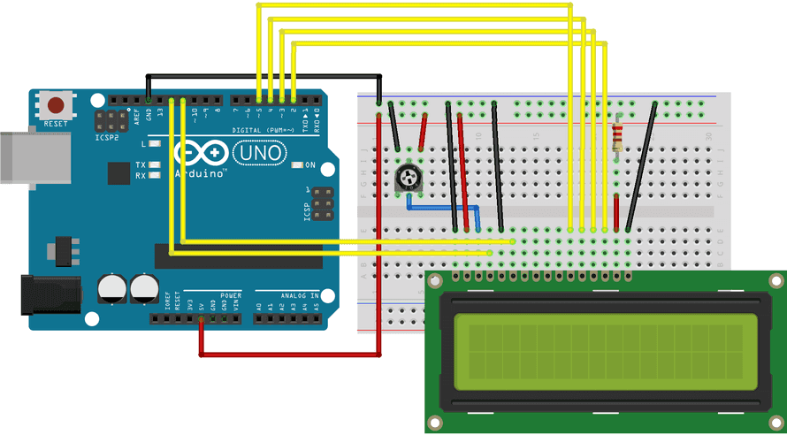
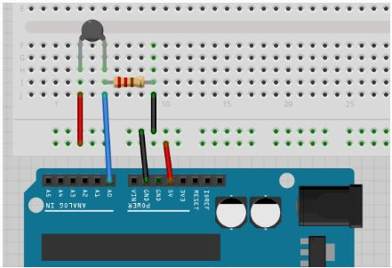
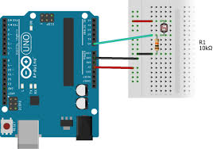

# LUTE – Luminance & Temperature monitoring system
**LUTE** is a simple environmental monitor built with an Arduino UNO. It reads ambient light levels and room temperature, displaying the data on an LCD screen in real-time.

## Hardware required
- Breadboard (generic)
- Arduino UNO
- Jumper wires (generic)
- Thermistor NTC 10K
- Photo resistor
- 2 x Resistor 10k ohm
- 220 ohm resistor
- LCD Screen (compatible with Hitachi HD44780 driver)
- 10k ohm potentiometer





## Pin Mapping

| LCD Pin | Arduino Port |
| --- | --- |
| **D7** | PD2 |
| **D6** | PD3 |
| **D5** | PD4 |
| **D4** | PD5 |
| **E** | PB3 |
| **RS** | PB4 |
| **VSS / R/W** | Ground |
| **VDD** | 5V |
| **Thermistor**| A0 |
| **Photoresistor** | A1 |

## Dependencies
You need the `avr-libc` toolchain to compile the project.

```sh
sudo apt-get update
sudo apt-get install gcc-avr avr-libc avrdude
```

## Build
A Makefile is included to handle the compilation and flashing process.

```sh
make          # Compile the code
make upload   # Flash to the Arduino
```

## Demo
https://github.com/user-attachments/assets/fd8a656e-5436-48ab-84ef-243d97d51cec

## References
- [arduino](https://docs.arduino.cc/hardware/uno-rev3/)
- [LCD Screen datasheet](https://cdn.sparkfun.com/assets/9/5/f/7/b/HD44780.pdf)

